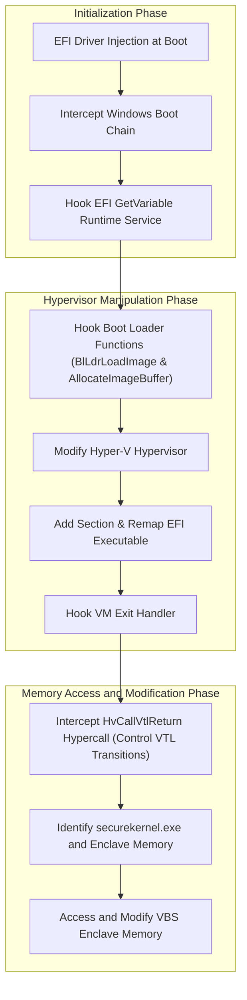

# SecureHack

This is a cheat for our own simple 2D game [SecureGame](https://github.com/SamuelTulach/SecureGame), which implements its game logic inside a [VBS enclave](https://learn.microsoft.com/en-us/windows/win32/trusted-execution/vbs-enclaves). In order to access the enclave's memory, it uses a custom EFI driver that hooks into the Windows boot chain, intercepts the loading of the Hyper-V module, patches it in such a way to hook VM exit to effectively hyperjack it, gathers information about `securekernel.exe` and the enclave itself, and implements a backdoor that can be used by normal processes running in VTL0 to copy memory between them and the enclave. Tested on Windows 11 24H2 (26100.2314).

Read the blog post to learn more:  
- [From firmware to VBS enclave: bootkitting Hyper-V](http://tulach.cc/from-firmware-to-vbs-enclave-bootkitting-hyper-v/)

## Video

## Process Flow

The following Mermaid diagram outlines the sequence of operations that occur as the system boots and is manipulated to allow access to secure enclave memory:

## Credits
- [Voyager](https://blog.back.engineering/20/04/2021/) project by [IDontCode](https://blog.back.engineering/researchers/_xeroxz/) - Memory manipulation, VM-exit hook  
- [DmaBackdoorHv](https://github.com/Cr4sh/s6_pcie_microblaze/tree/master/python/payloads/DmaBackdoorHv) project by [Cr4sh](https://github.com/Cr4sh) - `securekernel.exe` VTL return call intercept idea  
- [VisualUefi](https://github.com/ionescu007/VisualUefi) project by [ionescu007](https://github.com/ionescu007)